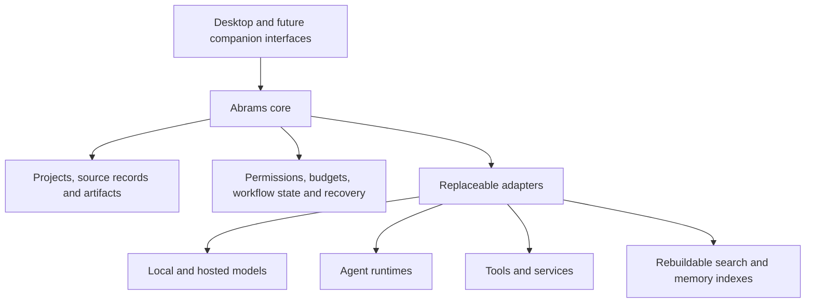

# Abrams Intelligence

### A modular AI platform designed around lasting user control

Abrams Intelligence is a personal project by **Daniel Abrams** exploring a local-first platform for research, coding, planning and document workflows. The central idea is simple: models and tools should be interchangeable while a person's projects, data and settings remain their own.

[Interactive architecture explorer](https://daniel-abrams-portfolio-lab--danielmabrams.replit.app/architecture) · [Gamma presentation](https://gamma.app/docs/for2zexybupmugn) · [Portfolio](https://theonetruedaniel.github.io/)

## Project status

**Architecture and foundations — September 2026.** The working project has a 19-document architecture baseline, requirements traceability, decision records, integration evaluation criteria, a phased roadmap, and tooling for inventory and artifact/readiness checks. The core application implementation has not started.

This repository presents a public overview of that design. The interactive explorer is a simulation using mock components and fictional data. It demonstrates intended behavior rather than live provider integrations.

## The problem

AI tools change quickly. A useful personal platform should make it possible to try a different model, runtime or memory index without rebuilding projects or surrendering control of their data. It should also make consequential actions, usage limits and the state of long-running tasks understandable.

## Start here

- **Two-minute overview:** read the diagram below and [three design tradeoffs](docs/reviewer-guide.md).
- **Technical research:** explore [candidate assessments](docs/candidate-research.md) and the [planned bake-off](docs/evaluation-method.md).
- **Try the concept:** open the architecture explorer above, switch a mock model route, and inspect the simulated task controls. No installation or API key is needed to read this repository.

The public artifacts are Markdown documents and synthetic JSON examples. There is no runnable Abrams application or product test suite in this showcase. The linked demo is hosted separately; the documents remain useful if that host is unavailable.

## Design at a glance

- **Selectable models:** explicit local or hosted routes, with visible cost and privacy boundaries.
- **Durable source data:** original records remain separate from summaries, embeddings and caches.
- **Scoped actions:** tools operate within defined permissions; models cannot grant themselves authority.
- **Clear controls:** pause, stop, inspect and resume are designed into the workflow.
- **Replaceable integrations:** external components connect through narrow adapters.

## Explore the design

| Document | What it explains |
|---|---|
| [Architecture](docs/architecture.md) | Core ownership, adapters and the lifecycle of a task |
| [Design decisions](docs/design-decisions.md) | Tradeoffs behind local data, model selection and execution controls |
| [Reviewer guide](docs/reviewer-guide.md) | Concrete examples of requirements, tradeoffs and evidence |
| [Candidate research](docs/candidate-research.md) | What LangChain, LangGraph, Mem0, AutoGPT, OpenClaw and Open-SPDD could contribute |
| [Evaluation method](docs/evaluation-method.md) | Baselines, failure cases and evidence needed before selecting a component |
| [Roadmap](docs/roadmap.md) | What exists, what is being validated and what comes later |
| [Illustrative workflow](examples/research-workflow.json) | A synthetic example of explicit scope and task state |
| [Source and status notes](docs/source-notes.md) | How this public overview relates to the working project |

## My contribution

I define the requirements, prioritize capabilities, evaluate integration choices and review the design against practical workflows. I use AI assistance for research, documentation, prototyping and code development. This project reflects my interest in connecting useful interfaces with clear operational rules and maintainable systems.

## Feedback and reuse

Research corrections and architecture feedback are welcome through [issues](https://github.com/theonetruedaniel/abrams-intelligence/issues). See [contribution guidance](CONTRIBUTING.md) and the [documentation changelog](CHANGELOG.md). This public showcase currently has no open-source license. Upstream projects retain their own licenses; referencing a candidate does not imply affiliation or integration.

**Daniel Abrams** · Atlanta, Georgia · [LinkedIn](https://www.linkedin.com/in/danielmabrams/) · [GitHub](https://github.com/theonetruedaniel)
