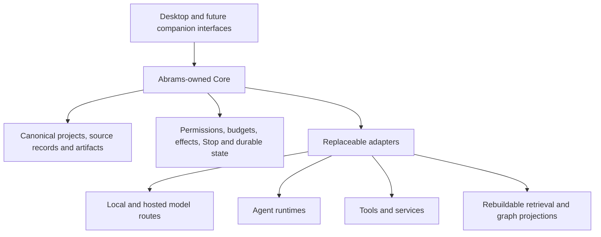

# Abrams Intelligence

A local-first personal AI platform in development, designed so models and tools can change while projects, source records and user controls remain stable.

I am building Abrams Intelligence for research and learning, coding and creative projects, document work and everyday coordination. The engineering question is how to make useful AI components replaceable without giving them ownership of credentials, permissions, budgets or durable task state.

[Run the offline dispatcher](tools/development-dispatcher/README.md) · [Architecture explorer](https://theonetruedaniel.github.io/architecture/) · [Presentation](https://gamma.app/docs/for2zexybupmugn) · [Portfolio](https://theonetruedaniel.github.io/)

## Current progress — October 4, 2026 (UTC)

The offline developer dispatcher is now published in this repository. [PR #1](https://github.com/theonetruedaniel/abrams-intelligence/pull/1) merged on October 3, 2026 EDT (October 4 UTC). The product Core and desktop remain in preparation. The [progress ledger](docs/progress.md) separates published tooling, the unpublished write-runner candidate and the next unfinished step in the existing plan.

| Area | What exists | Limit |
| --- | --- | --- |
| Architecture | Preserved 19-document baseline, requirements, decision records and comparison criteria | Design does not establish implemented behavior |
| Host/build preparation | Scoped attended synthetic readiness; native-tool and locked-source intake evidence | Broader workloads and current build admission remain gated |
| Product Core and desktop | October 1 R3 reviewed specification-input freeze and Tauri/PWA comparison plan | Shared reference implementation and candidate acceptance remain unrun; no production Core selected |
| Developer dispatcher | Published source, tests and a five-scenario offline demo; 250 default tests discovered, 227 passed and 23 skipped | Synthetic checks do not admit live editing or establish model quality |
| Synthetic write-runner update | Local reviewed candidate: 238 passed, 23 skipped; nine controller probes and 11 focused tests passed | Separate unpublished update; synthetic receipts do not establish live containment |
| Laya development selector | September 29 frozen-corpus/resource experiment | Exact evaluated default rejected: 45% ordinary acceptable proposals versus 90% required, plus memory failure |
| Public demonstrations | Working architecture explorer and synthetic walkthroughs | Simulated behavior; no live integration or executed product recovery proof |

The product is in **Phase 2 preparation**, not a released personal assistant. The scoped Phase 1 disposition does not imply unrestricted host readiness. The R3 specification-input freeze is recorded. Current resource admission, outstanding executable/native review, containment and the shared reference implementation precede product candidate comparison. [Roadmap and gates](docs/roadmap.md) · [Results, measurements and exclusions](docs/results-and-evidence.md).

## Run the published component

With Python 3.13 or later, from the repository root:

```powershell
cd tools/development-dispatcher
python -m scripts.dispatch.demo
python -m unittest discover -s tests/dispatch -p test_demo.py -v
```

The five-scenario demo checks routine routing, consequential review, return to a routine route, an explicit Manual choice and a blocked unavailable Manual route. Expected output is `5/5 checks passed`. These are offline previews using synthetic tasks and a synthetic catalog: every preview reports `dispatched: false`, no model executes a task, and real account usage remains unknown. No package installation, account, API key, model download or WSL session is needed for these two commands. These Codex development presets do not restrict the provider-neutral product design.

October 4 verification for this published source package: **227 tests passed, 23 skipped, zero failures/errors** in the full default dispatcher suite, with the five demo scenarios and three focused demo tests also passing. The 23 skips cover nine Linux-only transport tests, twelve opt-in containment tests and two unavailable symlink-privilege cases. This is dispatcher coverage, not full-platform acceptance or current-build live containment evidence. The October 1 result of 88 selected tests and four preview checks remains separate historical evidence.

[Component walkthrough](docs/development-dispatcher.md) · [Recorded output](tools/development-dispatcher/demo-transcript.txt) · [Verification scope](tools/development-dispatcher/VERIFICATION.md) · [Evaluation matrix](tools/development-dispatcher/EVALUATION.md)

## A quick reading path

1. Open the [architecture explorer](https://theonetruedaniel.github.io/architecture/) to inspect the intended control flow. It uses mock components and fictional data.
2. Follow the [research task walkthrough](docs/research-workflow-walkthrough.md) to see scope, sources, Stop and ambiguous-outcome handling as a design scenario.
3. Browse the [87-repository catalog](docs/repository-catalog.md) for verified links, purposes, architecture fit and current evaluation states. The [full register](docs/candidate-research.md) accounts for 188 entries, including routes, controls and prerequisites.
4. Inspect the [evaluation method](docs/evaluation-method.md) and [results](docs/results-and-evidence.md) to separate measured evidence from acceptance plans.

The repository now contains runnable development tooling alongside architecture documents and illustrative JSON. It does not yet contain an installable personal-assistant product. The architecture explorer remains a separately hosted simulation.

## Design decisions


```mermaid
flowchart TB
    UI[Desktop and future companion interfaces] --> CORE[Abrams-owned Core]
    CORE --> DATA[Canonical projects, source records and artifacts]
    CORE --> CONTROL[Permissions, budgets, effects, Stop and durable state]
    CORE --> ADAPTERS[Replaceable adapters]
    ADAPTERS --> MODELS[Local and hosted model routes]
    ADAPTERS --> RUNTIME[Agent runtimes]
    ADAPTERS --> TOOLS[Tools and services]
    ADAPTERS --> INDEX[Rebuildable retrieval and graph projections]
```

**Keep authority in one place.** A runtime can propose work; Core must own grants, exact routes, credentials, effect receipts and recovery. This adds adapter work, but makes a runtime replacement less likely to change what a task is allowed to do.

**Start with the simpler memory control.** Canonical SQLite records and relational/full-text retrieval come before optional vector or graph projections. Richer retrieval must show a measurable benefit and preserve source revisions, deletion and rebuild behavior.

**Compare by role.** Tauri versus local web/PWA tests the shell. Runtime conformance is separate from model quality. Workflow ideas, reusable components and whole-product adaptation are separate studies. A popular upstream repository is not automatically an approved dependency.

**Treat uncertainty as a state.** Requesting cancellation is different from confirming it. A timeout after an external effect needs reconciliation before another attempt. The public walkthrough explains this rule; it does not claim a product recovery test has run.

## What the research currently says

The register accounts for 150 original discovery entries and 38 later proposed entries, including internal controls and prerequisites. Most external candidates have source research or plans, not benchmark results. No production runtime/model pairing has been adopted.

One measured trade-off is the Laya development selector: its speed did not compensate for failed quality and memory thresholds. The existing deterministic rules remain the fallback. The published dispatcher tests demonstrate offline routing and lifecycle invariants with synthetic transports. They do not establish model quality, live editing or monetary savings.

## Next work and gates

Current-build direct-tool mediation and exact live qualification remain unresolved for the developer dispatcher. Further local checks must preserve that boundary; passing synthetic tests cannot enable live editing. The product plan still requires protocol/oracle review and contract freeze, executable/native review, current resource admission and containment evidence before the planned shell comparisons. No Tauri/PWA winner or production runtime/model pairing has been selected. [Roadmap and gates](docs/roadmap.md) · [Desktop-shell comparison](docs/desktop-shell-decision.md)

## Engineering documents

| Document | What to look for |
| --- | --- |
| [Architecture](docs/architecture.md) and [deep dive](docs/architecture-deep-dive.md) | Ownership boundaries and source-data lifecycle |
| [Design decisions](docs/design-decisions.md) | Local data, selection and execution trade-offs |
| [Desktop-shell study](docs/desktop-shell-decision.md) | Preregistered Tauri/PWA comparison; no winner yet |
| [Candidate research](docs/candidate-research.md) | Full inventory, source credits, intended roles and exclusions |
| [Evaluation method](docs/evaluation-method.md) | Controls, frozen tasks, metrics and decision rules |
| [Results and evidence](docs/results-and-evidence.md) | Actual selected tests, Laya results and unrun checks |
| [Acceptance map](docs/acceptance-evidence-map.md) | Illustrative requirements and future proof obligations |
| [Roadmap](docs/roadmap.md) | Current phase and capability-specific gates |
| [Source notes](docs/source-notes.md) | Dates, provenance and public/private evidence boundary |
| [Reviewer guide](docs/reviewer-guide.md) | Questions to use when inspecting the design |

## My contribution and feedback

I define the requirements, prioritize capabilities, evaluate integration choices and review the design against practical workflows. I use AI assistance for research, documentation, prototyping and code development. Upstream authors retain credit for their projects; this repository does not imply affiliation or an installed integration.

Source-backed corrections and architecture questions are welcome through [issues](https://github.com/theonetruedaniel/abrams-intelligence/issues). See [contribution guidance](CONTRIBUTING.md) and [changelog](CHANGELOG.md). No open-source license has been selected for this repository. Publication of development-tool source does not change upstream licenses or admit live execution.

**Daniel Abrams** · [LinkedIn](https://www.linkedin.com/in/danielmabrams/) · [GitHub](https://github.com/theonetruedaniel)
