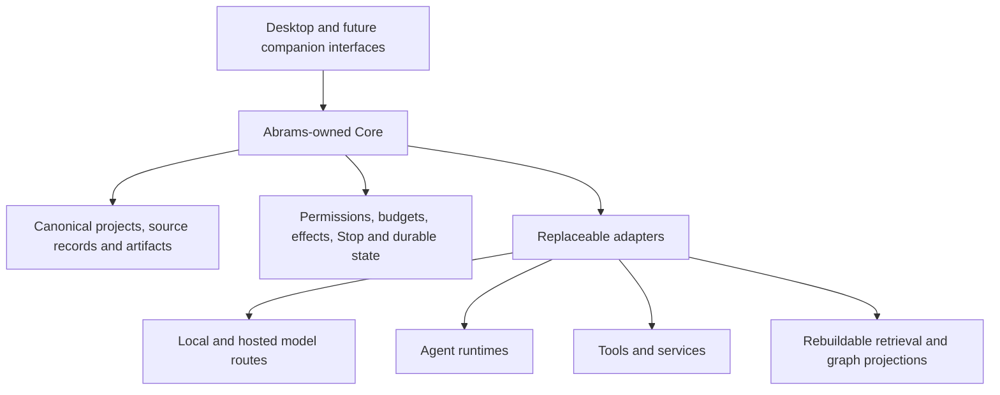

# Abrams Intelligence

A local-first personal AI platform in development, designed so models and tools can change while projects, source records and user controls remain stable.

I am building Abrams Intelligence for research and learning, coding and creative projects, document work and everyday coordination. Employment preparation is one optional workflow, not the whole product. The engineering question is how to make useful AI components replaceable without giving them ownership of credentials, permissions, budgets or durable task state.

[Architecture explorer](https://theonetruedaniel.github.io/architecture/) · [Presentation](https://gamma.app/docs/for2zexybupmugn) · [Portfolio](https://theonetruedaniel.github.io/)

## Current progress — October 1, 2026

| Area | What exists | Limit |
| --- | --- | --- |
| Architecture | Preserved 19-document baseline, requirements, decision records and comparison criteria | Design does not establish implemented behavior |
| Host/build preparation | Scoped attended synthetic readiness; native-tool and locked-source intake evidence | Broader workloads and current build admission remain gated |
| Product Core and desktop | Draft protocol/oracle specifications and Tauri/PWA comparison plan | No running Core, desktop candidate or BO-01/BO-02 result |
| Developer dispatcher | Existing offline routing/lifecycle tooling; October 1 isolated selected suite passed 88 tests and four preview checks | Source remains outside this showcase; synthetic checks do not admit live editing |
| Laya development selector | September 29 frozen-corpus/resource experiment | Exact evaluated default rejected: 45% ordinary acceptable proposals versus 90% required, plus memory failure |
| Public demonstrations | Working architecture explorer and synthetic walkthroughs | Simulated behavior; no live integration or executed product recovery proof |

The product is in **Phase 2 preparation**, not a released personal assistant. The scoped Phase 1 disposition does not imply unrestricted host readiness. Contract freeze, executable/native review, containment and comparison evidence remain necessary before product candidate execution. [Roadmap and gates](docs/roadmap.md) · [Results, measurements and exclusions](docs/results-and-evidence.md).

## A quick reading path

1. Open the [architecture explorer](https://theonetruedaniel.github.io/architecture/) to inspect the intended control flow. It uses mock components and fictional data.
2. Follow the [research task walkthrough](docs/research-workflow-walkthrough.md) to see scope, sources, Stop and ambiguous-outcome handling as a design scenario.
3. Read the [candidate register](docs/candidate-research.md) for every catalog/intake entry, upstream links and researched/planned/tested/rejected/selected distinctions.
4. Inspect the [evaluation method](docs/evaluation-method.md) and [results](docs/results-and-evidence.md) to separate measured evidence from acceptance plans.

There is no product install command in this public repository. It contains documentation and illustrative JSON; the developer-tool code candidate has a separate scope/ownership/license review. The linked demos are hosted separately.

## Design decisions

```mermaid
flowchart TB
    UI[Desktop and future companion interfaces] --> CORE[Abrams-owned Core]
    CORE --> DATA[Canonical projects, source records and artifacts]
    CORE --> CONTROL[Permissions, budgets, effects, Stop and durable state]
    CORE --> ADAPTERS[Replaceable adapters]
    ADAPTERS --> MODELS[Local and hosted model routes]
    ADAPTERS --> RUNTIME[Agent runtimes]
    ADAPTERS --> TOOLS[Tools and services]
    ADAPTERS --> INDEX[Rebuildable retrieval and graph projections]
```

**Keep authority in one place.** A runtime can propose work; Core must own grants, exact routes, credentials, effect receipts and recovery. This adds adapter work, but makes a runtime replacement less likely to change what a task is allowed to do.

**Start with the simpler memory control.** Canonical SQLite records and relational/full-text retrieval come before optional vector or graph projections. Richer retrieval must show a measurable benefit and preserve source revisions, deletion and rebuild behavior.

**Compare by role.** Tauri versus local web/PWA tests the shell. Runtime conformance is separate from model quality. Workflow ideas, reusable components and whole-product adaptation are separate studies. A popular upstream repository is not automatically an approved dependency.

**Treat uncertainty as a state.** Requesting cancellation is different from confirming it. A timeout after an external effect needs reconciliation before another attempt. The public walkthrough explains this rule; it does not claim a product recovery test has run.

## What the research currently says

The register accounts for 150 original discovery entries and 33 later proposed entries, including internal controls and prerequisites. Most external candidates have source research or plans, not benchmark results. No production runtime/model pairing has been adopted.

One measured trade-off is the Laya development selector: its speed did not compensate for failed quality and memory thresholds. The existing deterministic rules remain the fallback. October 1 dispatcher tests demonstrate selected offline routing and lifecycle invariants with fake transports, not model quality, live editing or monetary savings.

## Engineering documents

| Document | What to look for |
| --- | --- |
| [Architecture](docs/architecture.md) and [deep dive](docs/architecture-deep-dive.md) | Ownership boundaries and source-data lifecycle |
| [Design decisions](docs/design-decisions.md) | Local data, selection and execution trade-offs |
| [Desktop-shell study](docs/desktop-shell-decision.md) | Preregistered Tauri/PWA comparison; no winner yet |
| [Candidate research](docs/candidate-research.md) | Full inventory, source credits, intended roles and exclusions |
| [Evaluation method](docs/evaluation-method.md) | Controls, frozen tasks, metrics and decision rules |
| [Results and evidence](docs/results-and-evidence.md) | Actual selected tests, Laya results and unrun checks |
| [Acceptance map](docs/acceptance-evidence-map.md) | Illustrative requirements and future proof obligations |
| [Roadmap](docs/roadmap.md) | Current phase and capability-specific gates |
| [Source notes](docs/source-notes.md) | Dates, provenance and public/private evidence boundary |
| [Reviewer guide](docs/reviewer-guide.md) | Questions to use when inspecting the design |

## My contribution and feedback

I define the requirements, prioritize capabilities, evaluate integration choices and review the design against practical workflows. I use AI assistance for research, documentation, prototyping and code development. Upstream authors retain credit for their projects; this showcase does not imply affiliation or an installed integration.

Source-backed corrections and architecture questions are welcome through [issues](https://github.com/theonetruedaniel/abrams-intelligence/issues). See [contribution guidance](CONTRIBUTING.md) and [changelog](CHANGELOG.md). This showcase has no open-source license; publication of these documentation updates does not select a license for the separate code candidate.

**Daniel Abrams** · [LinkedIn](https://www.linkedin.com/in/danielmabrams/) · [GitHub](https://github.com/theonetruedaniel)
