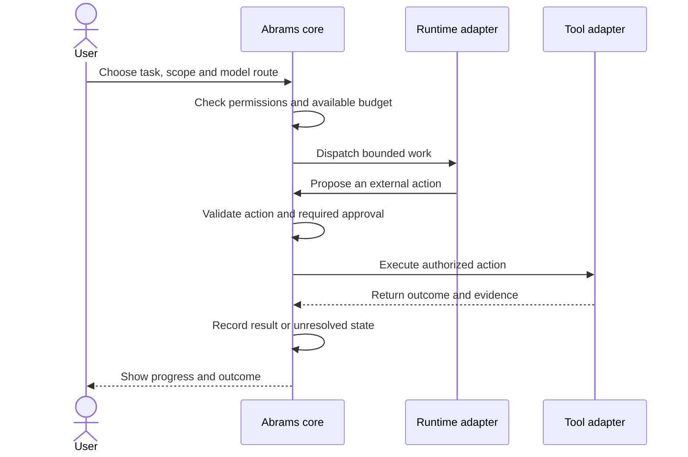

# Architecture

This document describes intended behavior. It does not represent implemented product APIs.

## What the core owns

Abrams owns project identity, authoritative records, permissions, budgets, workflow state, action history and recovery. Those responsibilities remain with the platform when an integration is replaced.

External runtimes can propose work and maintain temporary execution state. They do not become the only copy of project data or decide which actions are authorized.

## Replaceable components

| Component | Adapter responsibility | Retained by the core |
|---|---|---|
| Model provider | Requests, responses, usage and capability information | User selection, budget and disclosure rules |
| Agent runtime | Execute a bounded task and report events | Task identity, durable state and permissions |
| Tool service | Perform a typed operation and return a result | Action authorization and result reconciliation |
| Search or memory index | Derive searchable representations | Original source records and artifact references |
| Interface | Present tasks, files, approvals and activity | Shared projects, settings and history |

## A task from request to result

An ambiguous external result requires reconciliation before retry. A timeout alone does not prove that an action failed or that it is safe to repeat.

## Data and memory

Source records and artifacts are authoritative. Extracted text, summaries, embeddings and graphs are derived representations that can be rebuilt. This separation supports changing retrieval tools without losing the underlying information.

## Model selection

The design supports explicit model selection and an optional Auto mode. A provider or model becoming unavailable should produce a visible choice when a fallback changes cost, privacy or authentication boundaries. No particular commercial model is the permanent identity of the platform.

## Interface direction

Everyday navigation centers on projects, tasks, files and activity. Advanced settings expose route details, tool configuration and diagnostic evidence when useful. Future companion interfaces would use the same core state rather than maintain separate copies of memory and permissions.
